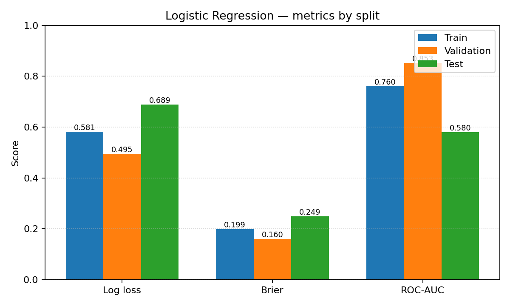
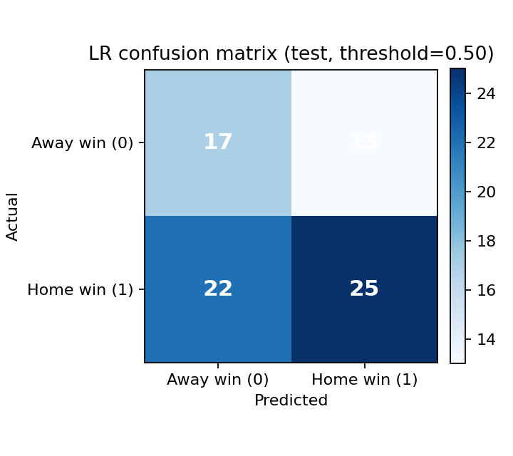

# Logistic Regression — NFL home win (2024)

*Generated: 2026-04-22 06:35:26 UTC*

## How to train and evaluate

From the project root (with dependencies installed):

```bash
python3 -m venv .venv
source .venv/bin/activate   # Windows: .venv\Scripts\activate
pip install -r requirements/requirements.txt
python code/main.py
```

Logistic Regression runs first; this file is overwritten each run. To only run Logistic Regression (faster):

```bash
python code/main.py --lr-only
```

## Data and split

- **CSV:** `data/ML_Ready_NFL_2024.csv`
- **Train:** regular season weeks **1–12** (179 games)
- **Validation:** weeks **13–14** (29 games)
- **Test:** week **>14** (late season + playoffs; 77 games)

Metrics use predicted **P(home team wins)** vs label `Home_Win`.

## Model

- **Pipeline:** `SimpleImputer(median)` → `StandardScaler` → `LogisticRegression`
- **Hyperparameters:** `max_iter=5000`, `C=0.5`, `class_weight='balanced'`, `random_state=42`

## Metrics

| Split | Games | Log loss | Brier | ROC-AUC |
|-------|------:|-----------:|------:|--------:|
| Train | 179 | 0.5811 | 0.1993 | 0.7602 |
| Validation | 29 | 0.4954 | 0.1602 | 0.8529 |
| Test | 77 | 0.6889 | 0.2491 | 0.5801 |

- **Log loss** — lower is better; penalizes overconfident wrong probabilities.
- **Brier** — lower is better; mean squared error of probabilities vs 0/1 outcome.
- **ROC-AUC** — higher is better; ranking quality (not calibration).

## Visualizations





## Features used

**Count:** 41

- `week`
- `home_rest_days`
- `away_rest_days`
- `home_win_pct_prior`
- `away_win_pct_prior`
- `home_games_prior`
- `away_games_prior`
- `home_pts_for_std`
- `away_pts_for_std`
- `home_pts_for_r5`
- `away_pts_for_r5`
- `home_pts_against_std`
- `away_pts_against_std`
- `home_pts_against_r5`
- `away_pts_against_r5`
- `home_yds_for_std`
- `away_yds_for_std`
- `home_yds_for_r5`
- `away_yds_for_r5`
- `home_yds_against_std`
- `away_yds_against_std`
- `home_yds_against_r5`
- `away_yds_against_r5`
- `home_to_for_std`
- `away_to_for_std`
- `home_to_for_r5`
- `away_to_for_r5`
- `home_to_against_std`
- `away_to_against_std`
- `home_to_against_r5`
- `away_to_against_r5`
- `home_won_std`
- `away_won_std`
- `home_won_r5`
- `away_won_r5`
- `diff_pts_for_r5`
- `diff_pts_against_r5`
- `diff_yds_for_r5`
- `diff_yds_against_r5`
- `diff_to_for_r5`
- `diff_won_r5`
